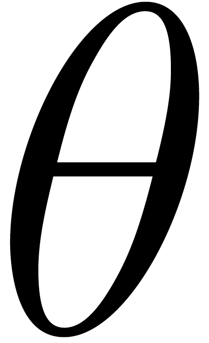
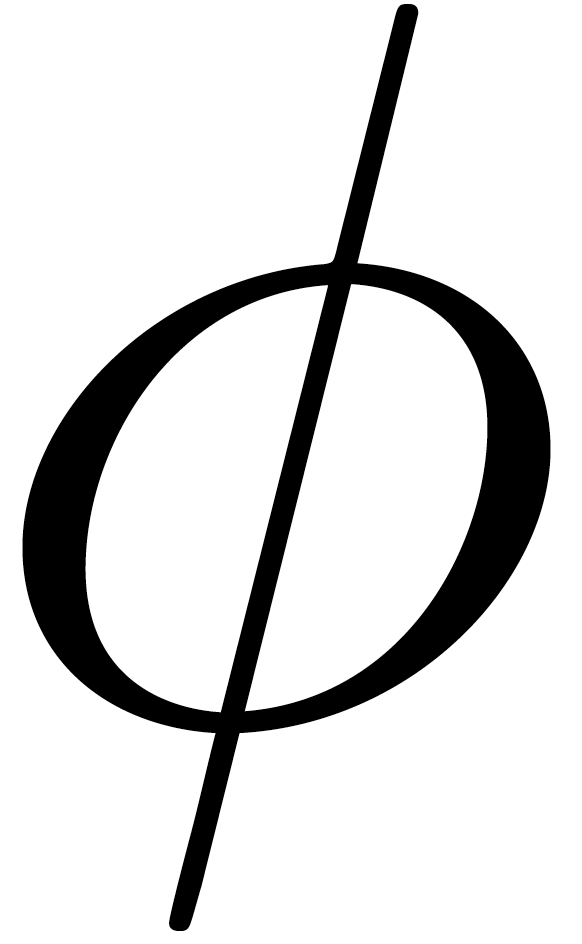
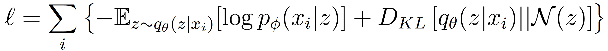
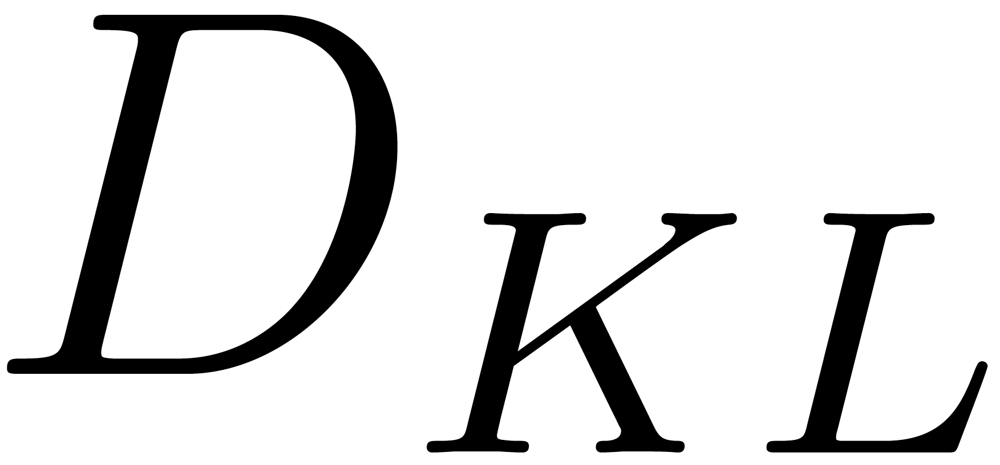
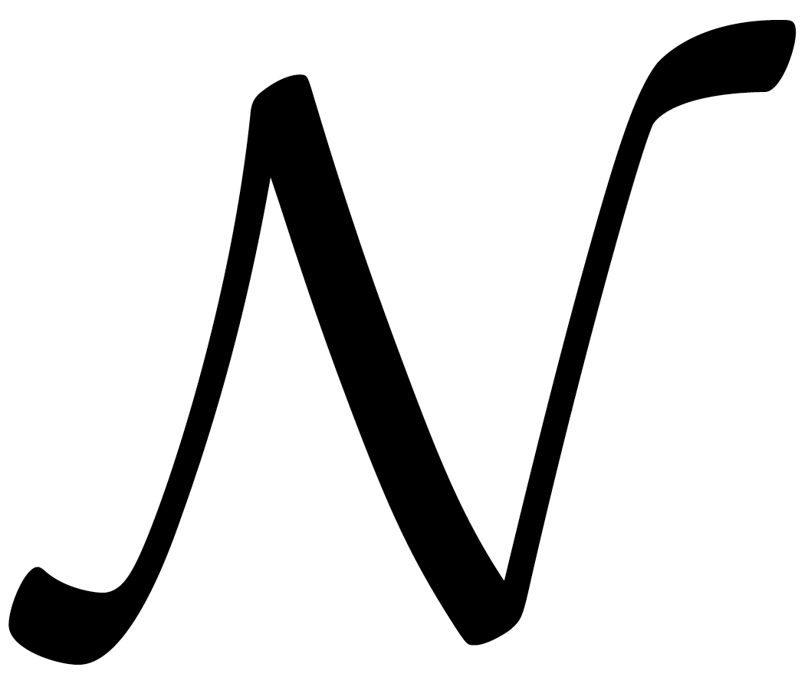
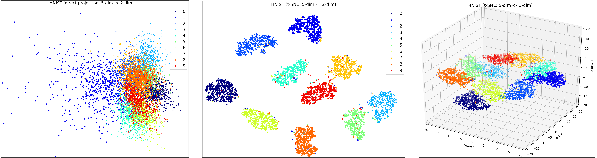
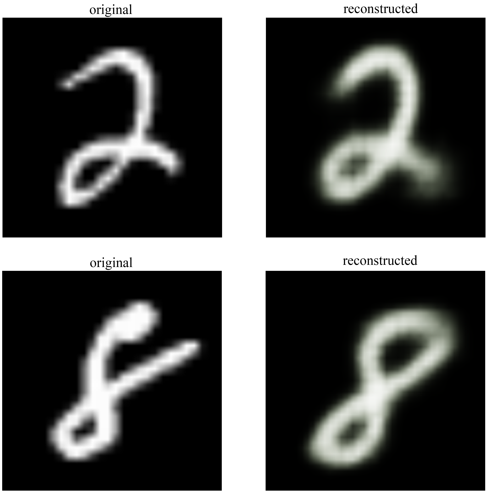
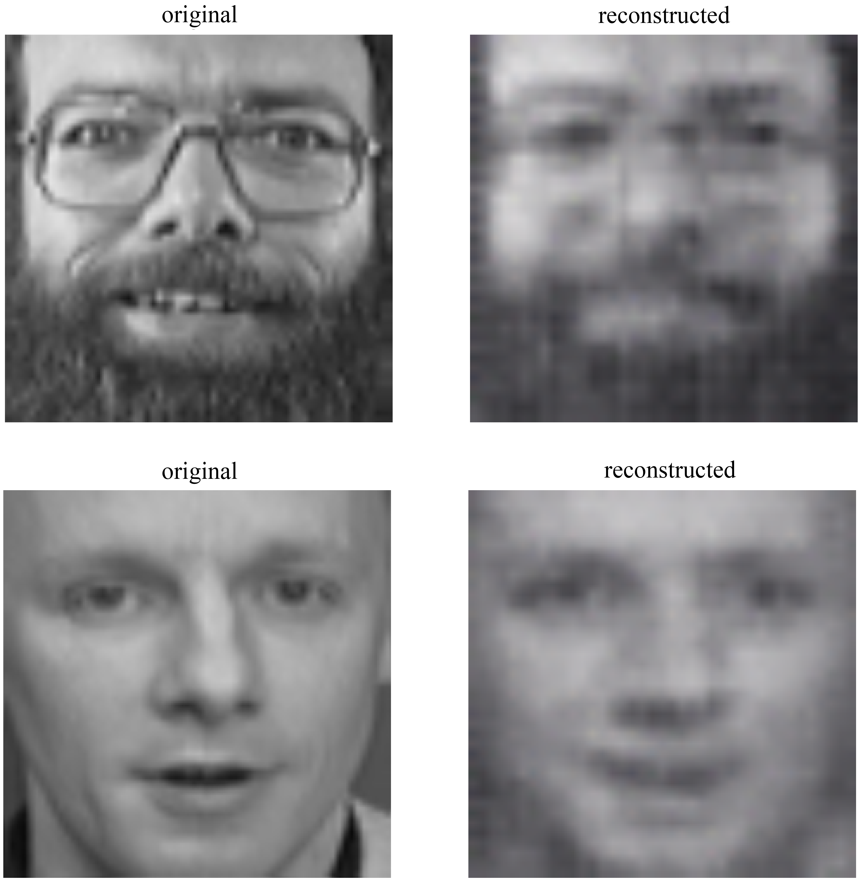
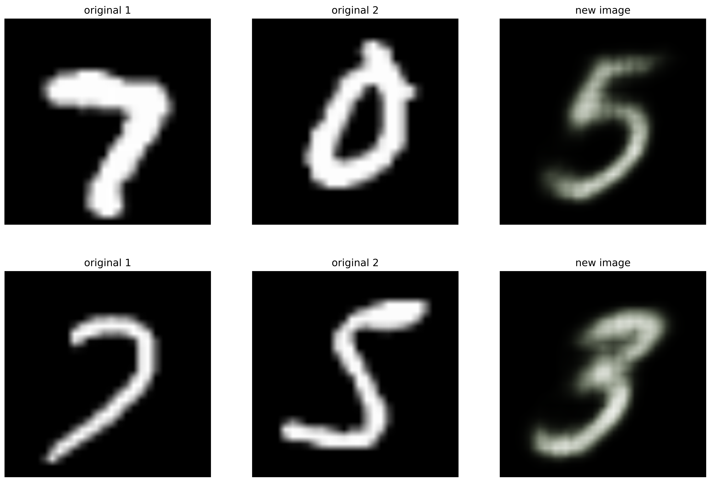
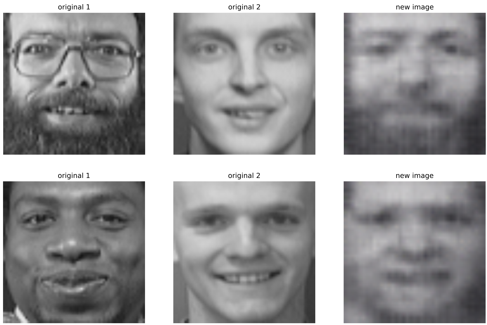

# Variational Autoencoder (VAE) + Transfer learning (ResNet + VAE)

This repository implements the VAE in PyTorch, using a pretrained ResNet model as its encoder, and a transposed convolutional network as decoder.  

## Datasets

### 1. MNIST

The [MNIST](http://yann.lecun.com/exdb/mnist/) database contains 60,000 training images and 10,000 testing images. Each image is saved as a 28x28 matrix.

### 2. CIFAR10

The [CIFAR-10](https://www.cs.toronto.edu/~kriz/cifar.html) dataset consists of 60000 32x32 colour images in 10 classes, with 6000 images per class.

### 3. Olivetti faces dataset

The [Olivetti](https://scikit-learn.org/0.19/datasets/olivetti_faces.html) faces dataset consists of 10 64x64 images for 40 distinct subjects.

## Model

A [VAE](https://arxiv.org/pdf/1312.6114.pdf) model contains a pair of encoder and decoder. An encoder  compresses an 2D image *x* into a vector *z* in a lower dimension space, which is normally called the latent space, while the decoder  receives the vectors in latent space, and outputs objects in the same space as the inputs of the encoder. The training goal is to make the composition of encoder and decoder to be "as close to identity as possible". Precisely, the loss function is:
,
where  is the Kullback-Leibler divergence, and  is the standard normal distribution. The first term measures how good the reconstruction is, and second term measures how close the normal distribution and q are. After training two applications will be granted. First, the encoder can do dimension reduction. Second, the decoder can be used to reproduce input images, or even generate new images. We shall show the results of our experiments in the end.

  - For our **encoder**, we do fine tuning, a technique in transfer learning, on [ResNet-152](https://arxiv.org/abs/1512.03385). ResNet-152 is a [CNN](https://en.wikipedia.org/wiki/Convolutional_neural_network) pretrained on ImageNet [ILSVRC-2012-CLS](http://www.image-net.org/challenges/LSVRC/2012/). Our **decoder** uses transposed convolution network. 
  
  

## Training 

- The input images are resized to **(channels, x-dim, y-dim) = (3, 224, 224)**, which is reqiured by the ResNet-152 model. 
- We use ADAM in our optimization process.
   

## Usage 

### Prerequisites
- [Python 3.6](https://www.python.org/)
- [PyTorch 1.0.0](https://pytorch.org/)
- [Numpy 1.15.0](http://www.numpy.org/)
- [Sklearn 0.19.2](https://scikit-learn.org/stable/)
- [Matplotlib](https://matplotlib.org/)

### Model ouputs

We saved labels (y coordinates), resulting latent space (z coordinates), models, and optimizers.

 - Run plot_latent.ipynb to see the clustering results
   
 - Run ResNetVAE_reconstruction.ipynb to reproduce or generate images
  
 - Optimizer recordings are convenient for re-training. 

## Results 

### Clustering

With encoder compressing high dimension inputs to low dimension latent space, we can use it to see the clustering of data points. 

### Reproduce and generate images

The decoder reproduces the input images from the latent space. Not only so, it can even generate new images, which are not in the original datasets.

